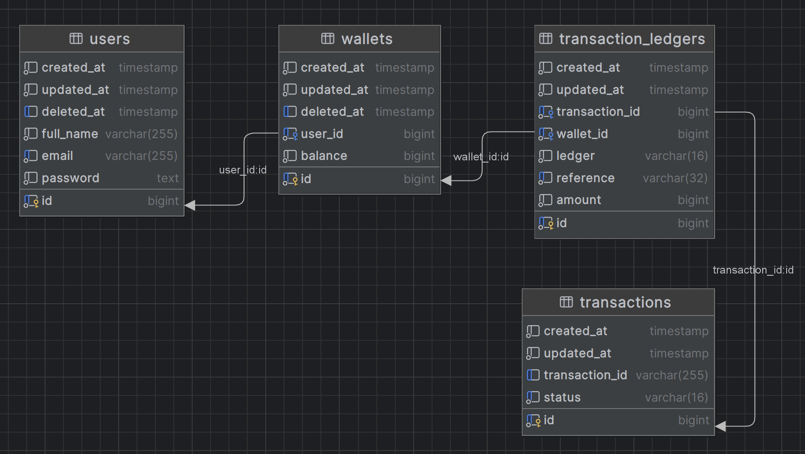

## Wallet API

Wallet API is a robust backend service designed to facilitate wallet-to-wallet disbursement.
This system provides a RESTful API endpoint which enables efficient money transfer,
utilizing Go and PostgreSQL for reliable data storage.

The study case is to **solve race conditions when concurrent clients transfer funds between wallets**,
while keeping balances consistent and preventing race condition & deadlock issues.

### Technology
1. Backend: Go v1.25.12
2. Database : Postgres 14.7
3. Docker (optional)

### Prerequisites
1. Docker

#### Library
- `net/http`: Native Go HTTP router using ServeMux
- `gorm`: The ORM for database operations
- `koanf`: The config environment library
- `validator`: validation library
- `uuid`: Generate and handle UUID
- `pgx`: PostgreSQL driver
- `zap`: Structured logging library
- `crypto`: Cryptography functions for password hashing
- `testify`: Unit Testing library
- `sqlmock`: Mock SQL for database testing. **(Mandatory to Install)**
- `mock`: Mocking framework. **(Mandatory to Install)**
- `goose`: database migration library. **(Mandatory to Install)**

### Installation
Before running the application, you need to setup the necessary prerequisites, as following :
1. Clone the repository
   ```bash
   git clone git@github.com:cchristian77/wallet-service.git
   ```

2. Configure environment variable </br>
   - Use **`localhost`** on `database.host` if the backend is not run on Docker. </br>
   - Use **`postgres_db`** on `database.host` if the backend runs via `docker compose`. </br>
   - The port of application is set to `9000` as default (or setup based on your preferred configuration).
   ```bash
   copy env.json.example env.json
   ```

3. Initialize services (database, backend app)
    ```bash
    docker compose up -d
    ```

4. Install dependencies
    ```bash
    go mod tidy
    ```

5. Run database migrations
   </br> Alternatively, you can use `wallet_db.sql` in the documentation directory. The database is already seeded.
   ```bash
   goose -dir ./migrations  postgres "user=admin password=password dbname=wallet sslmode=disable host=localhost" up
   ```

6. Seed database 
   ```bash
   psql "user=admin password=password dbname=wallet sslmode=disable host=localhost" -f ./migrations/seeder/seeder.sql
   ```

7. Run application (local run)
   ```bash
   go run ./cmd/web
   ```

### How to Test

1. Check healthcheck endpoint
    ```bash
    curl http://localhost:9000/healthcheck
    ```

2. Transfer (disbursement) endpoint </br>
   ```bash
   curl --request POST \
     --url http://localhost:9000/api/transfers/v1 \
     --header 'content-type: application/json' \
     --header 'Idempotency-Key: TRX-DEMO-1' \
     --data '{
       "from": 1,
       "to": 2,
       "amount": 1000
     }'
   ```

3. Run stress tests
   ```bash
   # Test case 1: drain wallet 1 under concurrent transfers
   go run ./stress_test/test_case1

   # Test case 2: opposite-direction transfers for 
   go run ./stress_test/test_case2
   ```
   
4. Run unit test 
   ```bash
   go test ./...
   ```

### Architecture Notes


- `users` table stores application users.
- `wallets` table stores wallets and their balances - one wallet account per user.
- `transactions` table is the transaction data (`transaction_id` from `Idempotency-Key`, status `PENDING` / `SUCCESS` / `FAILED`).
- `transaction_ledgers` table stores DEBIT & CREDIT ledgers for each money movements.

#### Locking Strategy
In a concurrent environment, multiple clients may attempt to transfer from the same wallet simultaneously,
which may lead to race condition issue on wallet balances. </br>

To prevent this, I serialize access to the transfer process using PostgreSQL row-level locks inside a single database transaction. 
The service claims the request via `Idempotency-Key`, locks both wallets with `SELECT … FOR UPDATE` in **ascending wallet ID order**, validates balance, writes DEBIT/CREDIT
ledgers, updates balances, then commits. On failure, the transaction is rolled back to ensure atomic (all-or-nothing) operations. </br>

Because the lock is row-level, concurrent transfers that share any wallet wait until the current lock is released;
while non-overlapping wallet pairs proceed without waiting. </br>

This approach eliminates race conditions by ensuring only one transfer mutates a given wallet at a time. <br>

Please check `docs/SOLUTION.md` for the detailed solution. </br>

### Author
Chris Christian
